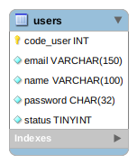

# Example Simple API with Node Postgres + Restify
Simple Example API Rest, using Node, restify, PostgreSQL, Docker and docker-compose.

## Getting Started :rocket:

First we'll clone the project.

```shell
$ git clone https://github.com/gustafsilva/example-node-postgres.git
```

Open the project and install node dependencies.

```shell
$ cd example-node-postgres
```
**With NPM**
```shell
$ npm install 
```
**With YARN**
```shell
$ yarn install 
```

Run the database in the container.

```shell
$ cd postgres
$ docker-compose up -d
```

Go back to the initial project folder and run the restify server.
```shell
$ cd ../
```
**With NPM**
```shell
$ npm start
```

**With YARN**
```shell
$ yarn start
```

### Ready! :+1: You can already hack the project. :sunglasses:

## Dependencies
* [Node](https://nodejs.org/)
* [NPM](https://www.npmjs.com/)
* [Docker](https://www.docker.com/)
* [docker-compose](https://docs.docker.com/compose/)

## Debugging project 

Some lines of the projects are commented (usually of `logs`), you can withdraw the comment to facilitate the debug in the `terminal`.

You can also run the project in development mode (using `nodemode` to capture changes on the server) with the command:
```shell
$ npm run start-dev
```

## Tests

To run the tests, make sure the database server is running and run the command:

```shell
$ npm test
// or
$ yarn test
```
[Jest](https://jestjs.io/) and [supertests](https://www.npmjs.com/package/supertest) were used to automate the tests. :heart:

## Automated commands :fire:
List of commands that can by using `npm`:
```shell
  $ npm install # install all node dependecies
  $ npm start # start server
  $ npm run start-dev # start development mode server (any change restarts the server)
  $ npm test # perfoms all the tests 
  $ npm run generate-docs # generates html documentation
  $ npm run clean-docs # remove html documentation
  $ npm run clean # remove documentation in thtml and modules node
```

List of commands that can by using `yarn`:
```shell
  $ yarn install # install all node dependecies
  $ yarn start # start server
  $ yarn run start-dev # start development mode server (any change restarts the server)
  $ yarn test # perfoms all the tests 
  $ yarn run generate-docs # generates html documentation
  $ yarn run clean-docs # remove html documentation
  $ yarn run clean # remove documentation in thtml and modules node
```

## Documentation
You can access the documentation [here](https://gustafsilva.github.io/example-node-postgres/docs/).
Or you can generate locally using the command:

```shell
$ npm run generate-docs
// or
$ yarn run generate-docs
```

Just open the `docs/index.html` file in your browser and start browsing... :green_book:

[jsdoc](http://usejsdoc.org) was used for document automation. :heart:

## More informations

### Single entity of the database:



## Contribution
If you have found an error or want to improve the example, create an `issue` or `pull request`.

## Contributors
 - Creator


## Licence
The contents of this repository are covered under the [MIT License](https://github.com/gustafsilva/example-node-postgres/blob/master/LICENSE).
